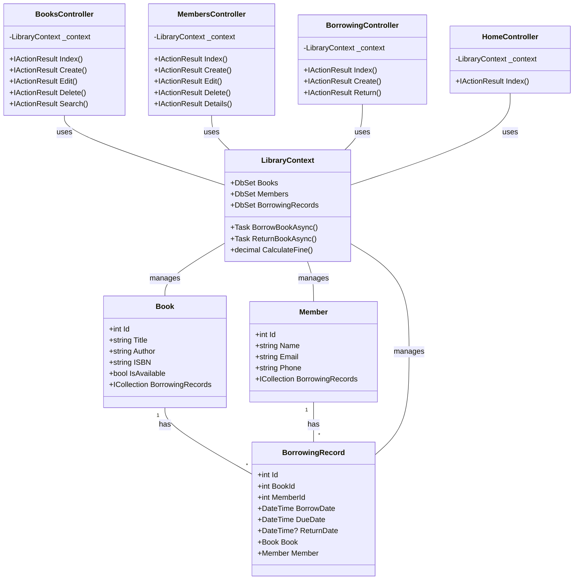

# Library Management System

A complete library management system built with **ASP.NET Core MVC** and **SQL Server**.

---

## Prerequisites

- **Visual Studio 2022**
- **SQL Server 2019** or later
- **.NET 8.0 SDK**

---

## Database Setup

1. Open **SQL Server Management Studio**.
2. Right-click on **Databases**.
3. Select **Restore Database**.
4. Choose **Device**, then navigate to `Database/LibrarySystem.bak`.
5. Click **OK** to restore the database.

---

## Configuration

1. Open the `appsettings.json` file.
2. Update the connection string as shown below:
   ```json
   {
     "ConnectionStrings": {
       "DefaultConnection": "Server=.;Database=LibrarySystem;Trusted_Connection=True;TrustServerCertificate=True;"
     }
   }
   ```

---

## Installation

1. **Clone the Repository:**
   ```bash
   git clone https://github.com/yourusername/LibrarySystem.git
   ```

2. **Navigate to the Project Directory:**
   ```bash
   cd LibrarySystem
   ```

3. **Restore NuGet Packages:**
   ```bash
   dotnet restore
   ```

4. **Run the Application:**
   ```bash
   dotnet run
   ```

---

## Features

- **Book Management:**
  - Create, Read, Update, Delete (CRUD) operations for books.
- **Member Management:**
  - Manage library members and their details.
- **Borrowing System:**
  - Issue and return books.
- **Fine Calculation:**
  - Automatically calculate overdue fines.
- **Search Functionality:**
  - Search for books and members.
- **Dashboard with Statistics:**
  - Overview of library data and analytics.

---

## Database Objects

### Stored Procedures

- **sp_SearchBooks**: Search for books based on title, author, or genre.
- **sp_BorrowBook**: Handle the borrowing process.
- **sp_ReturnBook**: Handle the returning process.
- **sp_GetOverdueBooks**: Retrieve overdue books.
- **sp_GetMemberActiveBorrowings**: Get active borrowings for a specific member.

### Functions

- **fn_CalculateFine**: Calculate overdue fines based on the due date and return date.

### Views

- **VW_BorrowingDetails**: View detailed borrowing records.

---


## UML Diagram

### Class Diagram

## License

This project is licensed under the [MIT License](LICENSE).


